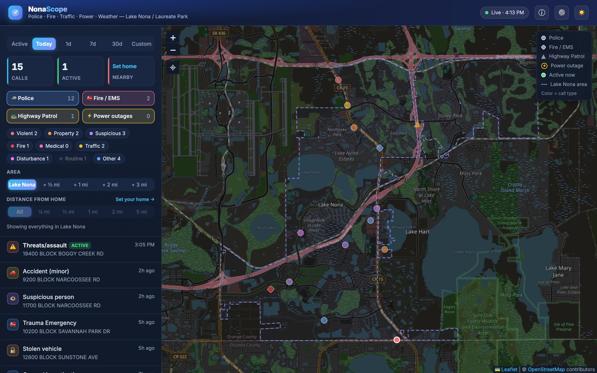

# NonaScope

**A live map of police, fire, traffic, power and weather activity in Lake Nona / Laureate Park (Orlando, FL).**

👉 **https://nonascope.com**

> 🧪 **Early access.** Expect rough edges — feedback is very welcome. See
> [Found a bug or have an idea?](#found-a-bug-or-have-an-idea) below.

NonaScope pulls public emergency-services feeds every 30–60 seconds, keeps a running history of what
happened nearby, and puts it on one map you can filter by time, area, type and distance from your home.

> NonaScope is an independent community project. It isn't affiliated with the City of Orlando, Orlando
> Police or Fire, the Florida Highway Patrol, OUC or the National Weather Service. Information can be
> delayed, incomplete or wrong. **It is not for emergencies — call 911.**

## What it shows

| Source | What you see |
|---|---|
| 🚓 Orlando Police | Police calls for service |
| 🚒 Orlando Fire | Fire and EMS calls |
| 🛣️ Florida Highway Patrol | Crashes and road incidents, e.g. on SR 417 |
| ⚡ OUC | Power outages, with customers affected and estimated restore time |
| 🌩️ National Weather Service | Active watches and warnings, shown as a banner |

The Orange County Sheriff isn't included: Lake Nona is inside Orlando city limits, so the Sheriff only
covers the unincorporated land around it.

## How it works

- **The area** is Orlando Police district K7, which covers Lake Nona, shown as the dashed outline.
  NonaScope also collects up to 3 miles around it; the **Area** switch shows Lake Nona alone or
  Lake Nona + ½, 1, 2 or 3 mi.
- **History builds up over time.** The public feeds only list calls that are open right now, so
  NonaScope saves each one as it appears and keeps it after it clears. Earlier days were backfilled from
  public archives and are marked **backfilled**. The ⓘ panel shows when live collection started and how
  far back the history goes.
- **Active calls** show the time they came in; cleared calls show how long ago.
- **Tags:** **ACTIVE** (still open), **NEARBY** (within ½ mile of your home), **+0.6 mi** (outside Lake
  Nona, in the surrounding ring), **approx** / **approx. area** (location is a best guess), **no pin**
  (the address is withheld or unavailable, so it isn't placed on the map).
- **Filters:** time (Active, Today, 1d, 7d, 30d or a custom date range back to the start of the history),
  area ring, distance from home, source and call type. Routine calls such as patrol and business checks
  are hidden by default — tap **Routine** to show them.
- **Nearby:** with a home set, tap the **Nearby** card to show only calls within ½ mile of home (it
  highlights while on); tap it again to see everything.
- **First visit** opens on **Today** and **Lake Nona** only. Your browser remembers whatever you pick after
  that (time, area, filters, light/dark), so it opens the way you left it.

## Your home address

Set it in ⚙️ Preferences — type an address or tap **📍 Use my current location** — to see distances and
NEARBY calls, and to use the **Nearby** filter. It's saved **only in your browser** — it isn't stored on the
server, and the site never shows anyone else's home. A typed address is looked up once via the US Census
geocoder; your current location never leaves your device.

## When it's updating or offline

NonaScope runs on a small home server. While it restarts for an update (usually under a minute) or if it's
briefly offline, the site still opens with the last copy of the map and shows **Reconnecting…** at the top;
it picks up live data again on its own, no reload needed. If you happen to open it for the first time right
then, you'll see a short "NonaScope is restarting" page that reloads by itself.

## Privacy

Analytics are privacy-friendly and cookie-less (self-hosted Plausible): page views and a count of how
often someone sets a home, never the address.

## Found a bug or have an idea?

- 🐞 [Report a bug](https://github.com/dstamen/nonascope/issues/new?template=bug_report.yml)
- 💡 [Suggest a feature](https://github.com/dstamen/nonascope/issues/new?template=feature_request.yml)

Both are also in the site's ⓘ panel. You'll need a free GitHub account. Please don't include your home
address or anything personal.

## Credits

Inspired by [ESMap](https://www.davnit.net/esmap/). Map data © OpenStreetMap contributors. District
boundaries from City of Orlando open data.
